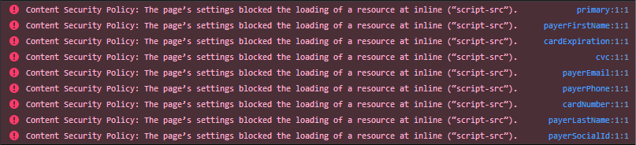

# Client Integration Manual

## Examples
[Check examples page](https://paymeservice.github.io/payme-jsapi/)

### Basic
-   [jsFiddle](https://jsfiddle.net/IlyaYakushev/50t31vxw/)

Basic example based on Bootstrap 3

### Example 1
-   [JavaScript](js/example1.js)
-   [CSS](css/example1.css)

### Example 1 RTL
-   [JavaScript](js/example1-he.js)
-   [CSS](css/example1-he.css)

The same UI/UX example like *Example 1* but shows how to tackle RTL languages 

### Example 2
-   [JavaScript](js/example2.js)
-   [CSS](css/example2.css)

### Example 3
-   [JavaScript](js/example3.js)
-   [CSS](css/example3.css)

### Example 4
-   [JavaScript](js/example4.js)
-   [CSS](css/example4.css)


## Step-by-step integration

1.  Include Client API Library into `<head>` section of your page
2.  Put markup, designed by your own or corporate site template
3.  Initialize integration with `API key`, get `Hosted Fields Manager` and manage protected fields using simple API

### Include Client API Library

```
<html lang="en">
    <head>
      ...
    
      <!-- Include Client API Library in your page -->
      <script src="https://cdn.paymeservice.com/hf/v1/hostedfields.js"></script>
      ...
    </head>
    <body>...</body>
</html>    
```

### Put your payment form markup

```
<html lang="en">
    <head>
        <!-- Include Client API Library in your page -->
        ...
    </head>
    <body>
        <!-- PAYMENT FORM STARTS HERE -->
        <div class="container">
          <div class="row">
            <div class="col-xs-12 col-md-4">
            
              <div class="panel panel-default credit-card-box">
                <div class="panel-body">
                  <form role="form" id="checkout-form">
        
                    <div class="row">
                      <div class="col-xs-12 col-md-12">
                        <div class="form-group" id="card-number-group">
                          <label for="card-number-container" class="control-label">CARD NUMBER</label>
                          
                          <!-- Container for Credit Card number field -->
                          <div id="card-number-container" class="form-control input-lg"></div>

                        </div>
                      </div>
                    </div>
        
                    <div class="row">
                      <div class="col-xs-7 col-md-7">
                        <div class="form-group" id="card-expiration-group">
                          <label for="card-expiration-container" class="control-label">EXPIRATION DATE</label>
                          
                          <!-- Container for Credit Card expiration date field -->
                          <div id="card-expiration-container" class="form-control input-lg"></div>
                          
                        </div>
                      </div>
                      <div class="col-xs-5 col-md-5 pull-right">
                        <div class="form-group" id="card-cvv-group">
                          <label for="card-cvv-container" class="control-label">CVV</label>
                          
                          <!-- Container for Credit Card CVV field -->
                          <div id="card-cvv-container" class="form-control input-lg"></div>
                          
                        </div>
                      </div>
                    </div>

                    <div class="row">
                      <div class="col-xs-12">
                      
                        <!-- Form submit button -->
                        <button class="subscribe btn btn-success btn-lg btn-block" id="submit-button" disabled>
                          Pay 55.00 USD
                        </button>
                        
                      </div>
                    </div>
        
                  </form>
                </div>
              </div>
            </div>
          </div>
        </div>
        <!-- PAYMENT FORM ENDS HERE -->
   
    </body>
</html>    
```

### Initialization and interaction
```
<html lang="en">
    <head>
        <!-- Include Client API Library into your page -->
        ...
    </head>
    <body>
        <!-- PAYMENT FORM STARTS HERE -->
        ...
        <!-- PAYMENT FORM ENDS HERE -->
        <script>
            
            var key = 'MPLXXXXX-XXXXXXXX-XXXXXXXX-XXXXXXXX'; // Merchant API key from Settings page in the dashboard
            
            PayMe.create(key, { testMode: true }).then(function (instance) {
           
              var fields = instance.hostedFields();
              
              var cardNumber = fields.create('cardNumber');
              var expiration = fields.create('cardExpiration');
              var cvc = fields.create('cvc');
              
              cardNumber.mount('#card-number-container');
              expiration.mount('#card-expiration-container');
              cvc.mount('#card-cvv-container');
              
              ...
              
            }).catch(function(error) {
                // Instantiation error occurs 
            })
        
        </script>
    </body>
</html>    
```

#### Let's break down code, presented above.

First of all you must get and provide your Merchant API key from Settings page in the dashboard.
```
...
// This is the Merchant API key (Test API key in this case)
var key = 'MPLXXXXX-XXXXXXXX-XXXXXXXX-XXXXXXXX';
...
```

Second, you must obtain integration **instance** for the merchant
```
var key = 'MPLXXXXX-XXXXXXXX-XXXXXXXX-XXXXXXXX';

// There is optional configuration object with testMode: true
// because we are using the API key from the test server
PayMe.create(key, { testMode: true })
    .then(function (instance) {
    
      // Here we can work with successfully initialized
      // integration instance - Integration Manager
       ...
    })
    .catch(function(error) {
      // Here you can handle instantiation error
      ...
    });
    
...
```

#### Initialization settings

Property          |   Default value  |   Available values  | Description
----------------- | :--------------: | :-----------------: | -------------
`testMode`        | false            | true / false        | `Test mode` - used to control in which environment payment will be processed
`language`        | 'en'             | 'en' / 'he'         | `Language` - controls the language of the messages and text direction (rtl or ltr). `en` (for English) or `he` (for Hebrew)
`tokenIsPermanent`| true             | true / false        | `Token is permanent` - Indicates whether it is a one-time-use or multi-use token


Next step - to initialize integration type and get corresponding manager

> **Note**
>
>for now only one integration type is available - **Hosted Fields**

#### Hosted fields integration type

This integration type allows you to use secure way to collect user's sensitive data for making payments.

To obtain Hosted Fields manager you must call `hostedFields` method 
```

PayMe.create(key, { testMode: true })
    .then(function (instance) {
    
      // Getting Hosted Fields Integration manager
      var fields = instance.hostedFields();
    })
    .catch(function(error) {
        ...
    });
...
```

As soon as you have Hosted Fields Manager you are ready to create actual protected fields. You can create as many fields as you need but you can create each field type only once. It means if `cardNumber` field was created you can't create more `cardNumber` fields, but you can create `payerEmail` and other (for details see **Tokenization** section).

For example let's create 3 most important fields

```

PayMe.create(key, { testMode: true })
    .then(function (instance) {
    
      
      var fields = instance.hostedFields();
      
      // Hosted fields creation
      var cardNumber = fields.create('cardNumber');
      var expiration = fields.create('cardExpiration');
      var cvc = fields.create('cvc');
    })
    .catch(function(error) {
        ...
    });
...
```

> **Hint**
>
> We propose to create field names within `Payme.fields` object
```
 // Instead of this
 var cardNumber = fields.create('cardNumber');
 // try to use this
 var cardNumber = fields.create(PayMe.fields.NUMBER);
```

Having created all of necessary fields, they must be mounted to the chosen page place. Fields will be shown on your page only after mounting
```

PayMe.create(key, { testMode: true })
    .then(function (instance) {
    
      
      var fields = instance.hostedFields();
      
      var cardNumber = fields.create('cardNumber');
      var expiration = fields.create('cardExpiration');
      var cvc = fields.create('cvc');
      
      // Mount credit card inside container with id="card-number-container"
      cardNumber.mount('#card-number-container');
      ...
    })
    .catch(function(error) {
        ...
    });
...
```

> **Hint**
>
> Field instance `mount` method accepts any valid query selector
```
// Select by id
cardNumber.mount('#card-number-container');

// Select by class
cardNumber.mount('.credit-card-wrapper');

// Select by attribute
cardNumber.mount('[data-role="credit-card-input"]');
```

> **Hint**
>
> We can be notified on result by promise, because field mounting is an asynchronous process  
```
...
// Mount credit card inside container with id="card-number-container"
cardNumber.mount('#card-number-container').then(function() {
    // Field was mounted successfully
}).catch(function(error){
    // There is error handling code
});
...
```

#### Hosted fields integration interaction

Right after field creation you can use field instance to listen basic set of events to interact with code on your page.

For example, let's listen `keyup` event on credit card field

```

PayMe.create(key, { testMode: true })
    .then(function (instance) {
    
      
      var fields = instance.hostedFields();
      
      var cardNumber = fields.create('cardNumber');
      ...
      
      cardNumber.on('keyup', function(event) {
        console.log(event);
      })
      
      // Mount credit card inside container with id="card-number-container"
      cardNumber.mount('#card-number-container');
      ...
    })
    .catch(function(error) {
        ...
    });
...
```
and each time when `keyup` event occurs on cardNumber field you will be notified. Keep in mind, for security reasons `event` object was significantly simplified (see **Field Event Object**) 

#### Field events

Using field events your can build you own logic. There is available limited set of events out of the box, those caused by security reasons  

Event type        | Fields       | Description
----------------- | :----------: | -------------
`change`          | all          | works like standard [change](https://developer.mozilla.org/en-US/docs/Web/Events/change)
`blur`            | all          | works like standard [blur](https://developer.mozilla.org/en-US/docs/Web/Events/blur)
`focus`           | all          | works like standard [focus](https://developer.mozilla.org/en-US/docs/Web/Events/focus)
`keyup`           | all          | works like standard [keyup](https://developer.mozilla.org/en-US/docs/Web/Events/keyup)
`keydown`         | all          | works like standard [keydown](https://developer.mozilla.org/en-US/docs/Web/Events/keydown)
`keypress`        | all          | works like standard [keypress](https://developer.mozilla.org/en-US/docs/Web/Events/keypress)
`validity-changed`| all          | emits when field validity state changed. Can be used for showing error messages
`card-type-changed`| *cardNumber*| emits when library detects vendor of entered Credit Card number


#### Field Event Object

Shape of `change`, `blur`, `focus`, `keyup`, `keydown`, `keypress`, `validity-changed` are the same among all the fields and can be either valid or not

```
// Valid field
{
    type: "focus",       
    event: "focus",      // event type
    field: "cardNumber", // field which emits this event 
    isValid: false       // field validity status
}
```

```
// Invalid field
{
    type: "focus",
    event: "focus",                     // event type
    field: "cardNumber",                // field which emits this event 

    isValid: false,                     // field validity status
    message: "Bad credit card number"   // validation error message
}
```

Shape of `card-type-changed` is little bit different and it can be used for displaying credit card brand icon

```
// Valid field
{
    type: "card-type-changed"
    event: "card-type-changed"
    field: "cardNumber"
    
    isValid: true,
    
    cardType: "visa"          // Card vendor 
}
```

```
// Invalid field
{
    type: "card-type-changed"
    event: "card-type-changed"
    field: "cardNumber"
    
    isValid: false
    message: "Bad credit card number",
    
    cardType: "visa"          // Card vendor 
}
```

here `cardType` property can be founded. All available types are listed below

 **cardType value**     |                      **Brand**                |   **Mask**
 :--------------------- | --------------------------------------------- | --------------------------
 `unknown`              |  **Unknown brand**                            |
 `amex`                 |  **American Express**: starts with 34/37      |   34♦♦ ♦♦♦♦♦♦ ♦♦♦♦
 `diners`               |  **Diners Club**: starts with 300-305/309...  |   300♦ ♦♦♦♦♦♦ ♦♦♦♦
 `jcb`                  |  **JCB**: starts with 35/2131/1800            |   35♦♦ ♦♦♦♦ ♦♦♦♦ ♦♦♦♦
 `visa`                 |  **VISA**: starts with 4                      |   4♦♦♦ ♦♦♦♦ ♦♦♦♦ ♦♦♦♦
 `mastercard`           |  **MasterCard**: starts with 51-55/22-27      |   51♦♦ ♦♦♦♦ ♦♦♦♦ ♦♦♦♦
 `discover`             |  **Discover**: starts with 6011/65/644-649    |   6011 ♦♦♦♦ ♦♦♦♦ ♦♦♦♦

So far so good, now you have form with some fields and you are ready to *tokenize* sensitive data to create actual sale

### Tokenization

Is a process of storing sensitive data in the protected vault and providing safe data for you, to make actual payment

To kick off tokenization you must call `tokenize(...)` method on `Ingeration Manager` instance

```

PayMe.create(key, { testMode: true })
  .then(function (instance) {

    var fields = instance.hostedFields();
    ...
    
    // Data for tokenization
    
    var saleData = {

      payerFirstName: 'Foo',
      payerLastName: 'Bar',
      payerEmail: 'foo-bar@domain.com',
      payerPhone: '1231231',
      payerSocialId: '12345',

      total: {
        label: 'Order #123123',
        amount: {
          currency: 'USD',
          value: '55.00',
        }
      }
    };
    
    // Call for tokenization
    
    instance.tokenize(saleData)
      .then(function (tokenizationResult) {     
              
        // Successfull tokenization
        // 
        // Now you can send 'tokenizationResult' to
        // your server and call `generate-sale` on Core API
        
        console.log(tokenizationResult);
      })
      .catch(function(tokenizationError) {
      
        // Failed tokenization
        // 
        // you can explore 'tokenizationError' object and show error message on your taste
        
        console.error(tokenizationError)
      });
  })

  ...
...
```

If you want let your users input additional data (First name, Last name, Email, Phone number, Social ID) rather provide 
by yourself you can use native HTML inputs within your page (please check our examples page). This approach let you 
to use any presenting, styling, formatting logic. To help you with validation we were exposing validators to you

#### Additional fields validators

Particular validator can be obtained and used by this code

```
// ...

var firstNameValidator = PayMe.validators[PayMe.fields.NAME_FIRST];
var validation = firstNameValidator.test('John');

// ...

console.log(validation);
```

#### Additional fields validation result

If validation result is success then `validation` would be `null` in the other case:
- `{required: true}` - if `firstNameValidator.test(...)` argument not defined
- `{invalid: true}` - if `firstNameValidator.test(...)` argument has unallowable value

> **Note**
>
> Values within additional fields must pass exposed validators. Without fulfilling this condition tokenization will fail!
>

#### tokenizationResult structure (successful tokenization)

```
{
  // Safe Credit Card data
  card: {                                         
    cardMask: "411111******1111",
    cardholderName: "Firstname Lastname",
    expiry: "1119"
  },
  
  // Service data
  type: "tokenize-success",
  testMode: true,                              
  token: "BUYER154-0987247Y-MLJ10OI7-LXRDNDYP", // Payment token for generating payment
  
  // Payer data
  payerEmail: "firstname-lastname@domain.com",
  payerName: "Firstname Lastname",
  payerPhone: "1231231",
  payerSocialId: "111123",
  
  // Payment data
  total: {
    label: "🚀 Rubber duck",
    amount: {
      currency: "USD",
      value: "55.00"
    }
  }
}
```

#### tokenizationError structure (tokenization failed)

```
{
  // Says that the form contains invalid values
  validationError: true
  
  // Here you can find error messages for particular field
  errors: {
    payerEmail: "Mandatory field",
    payerPhone: "Mandatory field"
  },
  
  type: "tokenize-error",
}
```
also you can receive such shape **(may be changed in the future)**
```
{

  // This error means that tokenization has already
  // performed for this Intergation Instance
  error: "Bad session",
  message: "Session expired or deleted",
  
  statusCode: 400,
  type: "tokenize-error",
}
```

### Tokenization and Mounted fields
As was mentioned above you can create as many different fields as you need but sometimes you have some user's data, supposed to be filled
and you don't want bother your users requested filling their data again. You can do that, just provide it within `Data for tokenization`
object.

For example if you already have *email* or *First + Last Name* and you want provide it directly, you can to it
```

PayMe.create(key, { testMode: true })
  .then(function (instance) {
    
    var fields = instance.hostedFields();
    
    // Create and Mount credit card field
      var cardNumber = fields.create('cardNumber');
      cardNumber.mount('#card-number-container');
      ...
    // Create and Mount credit card expiration field
      ...
    // Create and Mount CVV field
      ...
    // Create and Mount Social Id field
      ...
    // Create and Mount Phone number field
      ...
    
    // Provide all available data
    var saleData = {

      payerFirstName: 'Foo',            // First name field wasn't created, we must provide value
      payerLastName: 'Bar',             // Last name field wasn't created, we must provide value
      payerEmail: 'foo-bar@domain.com', // Email field wasn't created, we must provide value
      
      // payerPhone: '1231231',         // value isn't needed due created Phone number field
      // payerSocialId: '12345',        // value isn't needed due created Social Id field

      total: {
        label: 'Order #123123',
        amount: {
          currency: 'USD',
          value: '55.00',
        }
      }
    };
    
    // Call for tokenization
    
    instance.tokenize(saleData)
      .then(function (tokenizationResult) {     
              
        // Successfull tokenization
        // 
        // Now you can send 'tokenizationResult' to
        // your server and call `generate-sale` on Core API
        
        console.log(tokenizationResult);
      })
      .catch(function(tokenizationError) {
      
        // Failed tokenization
        // 
        // you can explore 'tokenizationError' object and show error message on your taste
        
        console.error(tokenizationError)
      });
  })

  ...
...
```

> **Rule of thumb**
>
> If you  didn't create field - provide corresponding value in tokenization payload,
> but with one exception. You can't provide values for *Credit Card Number*, *Credit Card Expiration* and *CVV* - corresponding fields must be created and mounted **always**

## What should be done with tokenized data?

You as an embedder may decide by yourself but main idea is **send tokenization data to backend and generate sale** using [Generate sale](https://www1.isracard-global.com/system/documentation#/reference/sales/generate-sale)

Let's say you have such tokenization result and sent it to your backend
```
{
  card: {                                         
    cardMask: "411111******1111",
    cardholderName: "Firstname Lastname",
    expiry: "1119"
  },
  
  type: "tokenize-success",
  testMode: true,                              
  token: "BUYER154-0987247Y-MLJ10OI7-LXRDNDYP",
  
  payerEmail: "firstname-lastname@domain.com",
  payerName: "Firstname Lastname",
  payerPhone: "1231231",
  payerSocialId: "111123",
  
  total: {
    label: "🚀 Rubber duck",
    amount: {
      currency: "USD",
      value: "55.00"
    }
  }
}
```

On the backend side you can build sale payload

**Generate Sale Attribute**                | **Tokenization Attribute**                   
------------------------------------------ | -------------------------------------------- 
`sale_price`                               | *tokenizationData.total.amount.value* - must be converted to the integer  |
`product_name`                             | tokenizationData.total.label
`currency`                                 | tokenizationData.total.amount.currency
`buyer_key`                                | tokenizationData.token

and send it to the `https://****.paymeservice.com/api/generate-sale`

# Security notes:

Our service has a strict Content Security Policy (CSP) which in some cases might cause error messages to appear in the browser console. These errors do not cause any kind of malfunction or security risk to our service, and you can safely ignore them.

- In most cases the errors are caused by third party extensions installed on the browser. Try turning off the extensions or browse in private mode.
- The error messages might also be caused by potentially malicious JavaScripts or browser extensions which inject JavaScript to the content pages. Our service is protected against such threats.

Example of such errors can be seen in the picture below:

